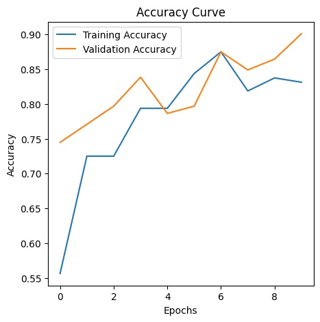
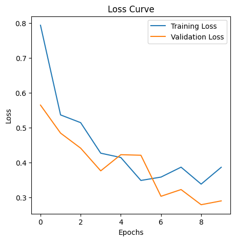

# Waste Classification Using Transfer Learning

## Project Overview
Automated waste sorting system using VGG16 transfer learning to classify images as recyclable or organic waste.

## Key Results
- **Feature Extraction Model**: 81% accuracy
- **Fine-Tuned Model**: 87% accuracy
- **Dataset**: 1200 images (800 train, 200 validation, 200 test)

## Technologies Used
- Python, TensorFlow 2.19.0, Keras
- VGG16 Transfer Learning
- NumPy, Matplotlib, scikit-learn
- ImageDataGenerator for augmentation

## Performance Metrics
| Model Type | Accuracy | Organic Precision | Recyclable Precision |
|------------|----------|-------------------|----------------------|
| Feature Extraction | 81% | 84% | 78% |
| Fine-Tuned | 87% | 84% | 91% |

## How to Run
1. Clone repository: `git clone https://github.com/Naftaliskp/Final-Project-Classify-Waste-Products.git`
2. Install dependencies: `pip install -r requirements.txt`
3. Run Jupyter notebook: `jupyter notebook waste_classification.ipynb`

## Results Visualization

